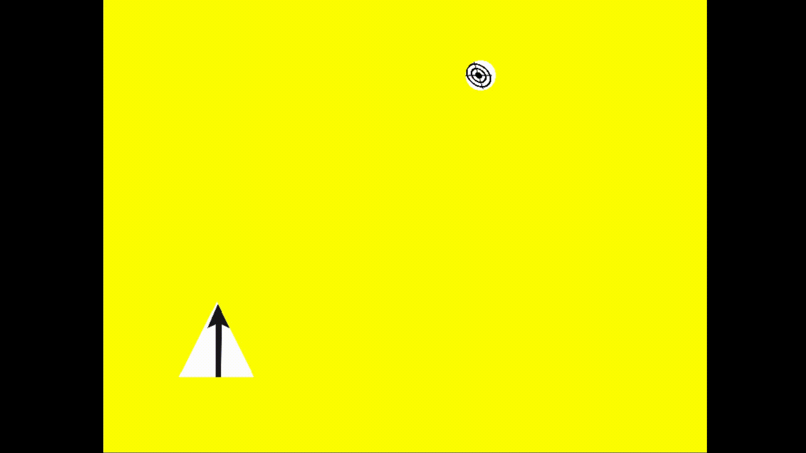

# Target follower

This is an animation made with [C++](https://en.wikipedia.org/wiki/C%2B%2B) and [OpenGL](https://www.opengl.org/).

OpenGL was used for rendering graphics and C++ was used for calling the OpenGL API and implementation of the animation logic.

## Features

The project is an animation determined by 2 textured components: a triangle, which is the follower and a circle, which is the target.

The flow of the animation is the following:

1) The folllower rotates around its center towards the target
2) The follower starts translating towards the target until there is a collision
3) Once a collision is detected, the target disappears and another one is spawned in a random position on the screen
4) Go to step 1.

## Requirements

In order to play you have got to first install:

1. [C++](https://docs.python-guide.org/starting/install3/linux/)
2. [OpenGL](https://www.opengl.org/)
3. [Glm](https://glm.g-truc.net/0.9.9/)
4. [SOIL](https://github.com/littlstar/soil)

The installation varies from distribution to distribution. Hopefully the links from above are useful to you.

## How to run

1. Open the main directory of the project (in here you should find a file called "run.sh")
2. Open the terminal in the current directory
3. Run the command "./run.sh"

## Final notes

I hope you enjoy playing this animation. If you find any bugs, feel free to submit them to blahoviciandrei1@gmail.com
